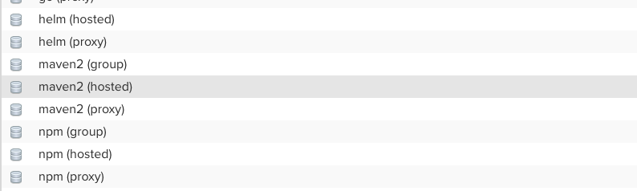

# sonatype/nexus3 설치하고 리포지토리 생성하기

## Docker 실행하기. 

- nexus 는 기본 포트로 8081 을 이용하여 서비스를 수해한다. 
- 다음 docker 커맨드를 활용하여 nexus를 실행하자. 

```go
$ docker run -d -p 8081:8081 --name nuxus sonatype/nexus3
```

- nexus 를 정지하기 위해서는 셧다운 시간을 부여하여 데이터베이스가 충분히 셧다운 할 수 있도록 다음과 같이 정지한다. 

```go
$ docker stop --time=120 nexus
```

- 정상으로 수행되었는지 테스트

http://localhost:8081


## Admin 계정으로 로그인하기. 


- nexus 를 처음 실행하면 Admin 계정으로 로그인이 필요하다. 
  - ID: admin
  - Password: nexus 설치 디렉토리의 admin.password 파일에 최초 비밀번호가 저장되어 있다.
  
### admin 비밀번호 얻기 

```go
$ docker exec -it nexus /bin/bash

```

- 위 명령어로 로그인하면 아래와 같이 루트 디렉토리에 접근할 수 있다. 

```go
bash-4.4$ ls

bin   dev  help.1  lib    licenses    media  nexus-data  proc  run   srv  tmp                uid_template.sh  var
boot  etc  home    lib64  lost+found  mnt    opt         root  sbin  sys  uid_entrypoint.sh  usr
```

- nexus-data 디렉토리에서 admin.pasword 내용을 확인한다. 

```go
cd nexus-data
cat admin.password

dee890e0-4762-4f33-a8e5-027d0070b92e
```

- 비밀번호를 복사하고, 아래와 같이 로그인하자. (우측 상단: Sign-In을 클릭)


### 비밀번호 재 설정 및 기타 설정 수행 

- 다음으로 비밀번호 재 설정 및 기타 설정을 수행하자. 


- 비밀번호를 재 설정하자. 


- Enable Anonymous Access:
  - 기본적으로 사용자들이 자격증명(credential) 없이 접속할 수 있도록 허용한다. 
  - 검색, 브라우징, 컴포넌트 다운로드를 리포지토리로 부터 수행할 수 있다. 
  - 조직 내 보안 규정을 고려하여 신중히 선택해얗나다. 
- Disable Anonymous Access:
  - 자격증명이 있는 사용자만이 접근할 수 있도록 제한한다. 

- 우리는 여기서 Disable Anonymous Access 를 선택하였다. 


- 설정을 완료하자. 

### 기타 nexus 사용

- 로그 확인하기 

```go
$ docker logs -f nexus
```

- 메모리 및 디스크 용량 설정 
- INSTALL4J_ADD_VM_PARAMS: 을 통해서 메모리크기, 루트 디렉토리 등을 설정할 수 있다. 
```go
$ docker run -d -p 8081:8081 --name nexus -e INSTALL4J_ADD_VM_PARAMS="-Xms2703m -Xmx2703m -XX:MaxDirectMemorySize=2703m -Djava.util.prefs.userRoot=/some-other-dir" sonatype/nexus3

```

- 데이터 볼륨 연동하기

```go
$ docker volume create --name nexus-data
$ docker run -d -p 8081:8081 --name nexus -v nexus-data:/nexus-data sonatype/nexus3
```

## Repository 생성하기. 

- 이제 리포지토리를 생성할 것이다. 
- 일반적으로 Spring 개발 환경에서 Maven 의존성 라이브러리 관리를 위해서 2가지 리포지토리를 생성한다. 
  - snapshot: 스냅샷은 개발 과정에서 사용되는 리포지토리이다. 
  - release: 실제 배포 버전의 라이브러리가 존재하는 리포지토리이다. 일반적으로 릴리즈는 redeploy가 되지 않도록 설정한다. 이는 실행 환경에서 안정적인 라이브러리 사용을 위해 필요한 설정이다. 
  
### 관리 리포지토리 목록 보기

- 이제 상단 메뉴에서 기어 아이콘틀 선택하자. 
  


- 그리고 Repository > Repositories 메뉴를 선택하자. 
- 리포지토리 목록을 확인할 수 있다. 


- 리포지토리 타입은 proxy, group, hosted 가 있다. 
  - proxy: 외부 리포지토리를 프록시 해준다. 즉, 내부 시스템에서 외부에 직접 접근하지 못하는 환경을 구성할때 프록시를 주로 사용한다. 
  - group: 여러 리포지토리를 그루핑 한다. 
  - hosted: 실제 현재 nexus에서 라이브러리를 제공한다. 주로 자체 개발한 라이브러리를 서비스할때 hosted 리포지토리를 설정한다.
  
### 리포지토리 생성

- 이제 리포지토리 생성을 위해서 "Create repository" 를 클릭한다. 

- Select Recipe를 통해서 nexus의 리포지토리 레시피를 선택한다. 
- 우리는 여기서 maven2 (hosted) 를 선택하자.



#### Snapshot 리포지토리 생성 

- 아래와 같이 리포지토리 생성 화면에서 다음과 같이 입력하자. 
  


- Name: my-repo-snapshot
- Version policy: Snapshot
- Layout policy: Strict
- Content Disposition: inline
- Deployment policy: Allow redeploy

- 위 설정을 통해서 snapshot 리포지토리를 생성했다. 

#### Release 리포지토리 생성 

- 동일하게 release도 다음과 같이 만들어 주자. 


- Name: my-repo-release
- Version policy: Release
- Layout policy: Strict
- Content Disposition: inline
- Deployment policy: Disable redeploy

## 사용자 생성 및 권한 부여

- 이제 사용자를 생성하고 권한을 부여하자. 

### Role 생성

- 우선 롤을 생성하자. 
- 롤은 어떠한 리포지토리에 접근할 수 있는지에 대한 정책을 설정하는 것이다. 
- Security > Roles 를 선택한다. 


- "Create role" 버튼을 클릭하자. 


- Role ID: my-repo-access
- Role name: my-repo-access
- Role Description: 설명 입력
- Privileges: 필터에 my-repo를 입력하자.
  - 이후 전체 리포지토리 정보를 선택하여 Given으로 등록한다. 

- 이제 "Create role" 버튼으로 롤을 생성한다. 

### 사용자 생성 

- 롤을 생성했다면 사용자를 생성하자. 
- Security > Users 를 선택한다. 


- "Create Users" 버튼을 클릭하고 다음과 같이 입력하자. 


- ID: my-repo-user
- First name: my
- Last name: repo
- Email: 사용자 이메일 주소 
- Password/Confirm Password: 적절히 입력한다.
- Status: Active
- Roles: my-repo-access 롤을 생성한다.

## Wrap UP

- 지금까지 Docker 를 이용하여 nexus3 를 설치하였다.
- 그리고 리포지토리를 snapshot, release 2개를 생성했다. 
- 해당 프로젝트만 사용할 수 있도록 Role과 User를 생성하였다. 
- 우리 프로젝트만을 위한 nexus 설정을 마쳤다. 