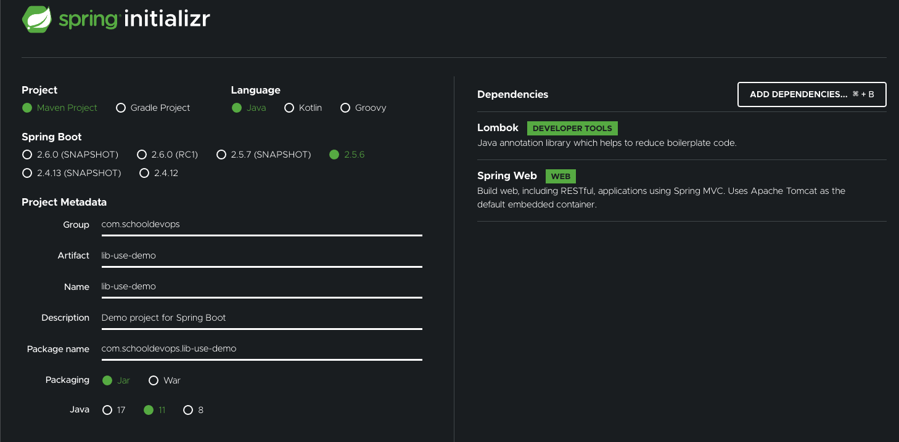

# Nexus에 Spring Maven 라이브러리 배포 및 사용하기

- Nexus Maven Repository 생성했다면 이제는 사용해볼 차례이다. 
- 작업은 다음과 같은 과정으로 진행된다. 
  - nexus 접근을 위한 credential 등록하기. (setting.xml)
  - nexus에 등록할 라이브러리 생성 및 Deploy 하기
  - 등록된 라이브러리를 사용하기 Maven Dependency 설정 및 사용하기
  - 릴리즈 디플로이 동작 확인하기.

## Nexus 접근을 위한 credential 등록하기 

- 우선 nexus에 사용자를 생성 했다면 이제 사용자의 credential 을 등록해야한다. 
- 참고: 이 작업을 하기 위해서 local에는 maven 을 사전에 설치해 두어야한다. 
  - maven 설치는 다음 [공식문서](https://maven.apache.org/install.html)를 참고하자.
- 우리는 이전 nexus3 설치시에 사용자를 다음과 같이 생성했었다. 
  - username: my-repo-user
  - password: 1234
- 이제 ~/.m2/setting.xml 파일을 생성하 (이미 존재한다면 아래 내용을 추가하면 된다.)

### setting.xml

```xml
<settings xmlns="http://maven.apache.org/SETTINGS/1.0.0"
   xmlns:xsi="http://www.w3.org/2001/XMLSchema-instance"
   xsi:schemaLocation="http://maven.apache.org/SETTINGS/1.0.0
   http://maven.apache.org/xsd/settings-1.0.0.xsd">

   <servers>
     <server>
       <id>my-repo-snapshot</id>
       <username>my-repo-user</username>
       <password>1234</password>
     </server>
     <server>
       <id>my-repo-release</id>
       <username>my-repo-user</username>
       <password>1234</password>
     </server>
   </servers>
 </settings>
```

- 위와 같이 서버 id, username, password 를 2쌍을 생성했다. 
  - id: my-repo-snapshot 은 스냅샷에 접근하기 위한 서버 설정 이름이다.
  - id: my-repo-release 는 릴리즈 배포 리포지토리에 접근하기 위한 설정 이름이다. 

## Nexus에 등록할 라이브러리 생성 및 Deploy 하기

- 이제는 서버에 등록할 라이브러리를 개발해 보자. 
- 라이브러리는 들어온 문자를 대문자로, 그리고 소문자로 바꾸는 유틸성 라이브러리를 간단히 만들 것이다. 

### 프로젝트 생성하기

- https://start.spring.io 에서 다음과 같이 프로젝트 하나를 생성하고 다운받자. 


### 유틸리티 코드 작성하기. 

- com/schooldevops/libdemo/services/StringUtil.java 파일을 생성하고 다음과 같이 작성한다. 

```java
package com.schooldevops.libdemo.services;

import lombok.extern.slf4j.Slf4j;

import java.util.Locale;

@Slf4j
public class StringUtil {

    public static String toUpper(String inputValue) {

        String convertedString = inputValue.toUpperCase(Locale.ROOT);

        log.info("toUpperCase: from {} to {}", inputValue, convertedString );
        return convertedString;
    }

    public static String toLower(String inputValue) {

        String convertedString = inputValue.toLowerCase(Locale.ROOT);
        log.info("toLowerCase: from {} to {}", inputValue, convertedString );
        return convertedString;
    }

}

```

- 위 라이브러리는 StringUtil 이라는 클래스로 정적 메소드 2개를 가진다. 
- toUpper는 들어온 문자를 대문자로 바꾼다. 
- toLower는 들어온 문자를 소문자로 바꾼다. 

### 라이브러리 등록 설정하기. 

- 이제는 라이브러리 등록을 위해서 pom.xml 파일에 다음 내용을 추가하자. 

```xml

... 생략 
    <distributionManagement>
        <snapshotRepository>
            <id>my-repo-snapshot</id>
            <name>my-repo-snapshot</name>
            <url>http://localhost:8081/repository/my-repo-snapshot/</url>
        </snapshotRepository>
        <repository>
            <id>my-repo-release</id>
            <name>my-repo-release</name>
            <url>http://localhost:8081/repository/my-repo-release/</url>
        </repository>
    </distributionManagement>
```

- distributionManagement: 이는 현재 라이브러리를 배포 관리자를 설정한다. 
- snapshotRepository: 는 스냅샷을 배포할 대상 리포지토리를 지정한다. 
  - id: 이 아이디는 setting.xml 에 등록한 스냅샷용 credential 아이디 이름과 동일해야한다. 
  - name: 리포지토리를 설명하는 이름이다. 
  - url: url은 nexus에서 해당 리포지토리의 경로이다. 
- repository: 리포지토리는 릴리즈용으로 설정하는 곳이다. 
  - id: 이 아이디 역시 setting.xml 에 등록한 release용 credential 아이디 이름과 동일해야한다. 
  - name: 위와 같이 설명 이름
  - url: url은 nexus에서 해당 리포지토리의 경로이다. 

***리포지토리 경로***


- 위 내용과 같이 nexus에서 상단 메뉴에서 큐브 아이콘 > Browse 를 클릭한다. 
- 목록이 나타나면 해당 리포지토리에서 URL 필드에서 "copy" 버튼을 클릭해서 해당 라이브러리 경로를 가져올 수 있다. 
- my-repo-snapshot 스냅샷 경로를 복하한 결과는 다음과 같다. 
  - http://localhost:8081/repository/my-repo-snapshot/

### 라이브러리 디플로이 하기. 

- 이제 라이브러리를 배포해 보자. 

```go
mvn clean compile deploy
```

- 사실 IDE를 이용한다면 'mvn depoy' 만 이용해도 된다. 

```go
Ξ nexus_samples/lib-demo → mvn clean compile deploy
[INFO] Scanning for projects...
[INFO] 
[INFO] ---------------------< com.schooldevops:lib-demo >----------------------
[INFO] Building lib-demo 0.0.1-SNAPSHOT
[INFO] --------------------------------[ jar ]---------------------------------
[INFO] 
[INFO] --- maven-clean-plugin:3.1.0:clean (default-clean) @ lib-demo ---
[INFO] 
[INFO] --- maven-resources-plugin:3.2.0:resources (default-resources) @ lib-demo ---
[INFO] Using 'UTF-8' encoding to copy filtered resources.
[INFO] Using 'UTF-8' encoding to copy filtered properties files.
[INFO] Copying 1 resource
[INFO] Copying 0 resource
[INFO] 
[INFO] --- maven-compiler-plugin:3.8.1:compile (default-compile) @ lib-demo ---
[INFO] Changes detected - recompiling the module!
[INFO] Compiling 2 source files to /Users/kido/Documents/06.PROGRAMMING_COURSES/nexus_samples/lib-demo/target/classes
[INFO] 
[INFO] --- maven-resources-plugin:3.2.0:resources (default-resources) @ lib-demo ---
[INFO] Using 'UTF-8' encoding to copy filtered resources.
[INFO] Using 'UTF-8' encoding to copy filtered properties files.
[INFO] Copying 1 resource
[INFO] Copying 0 resource
[INFO] 
[INFO] --- maven-compiler-plugin:3.8.1:compile (default-compile) @ lib-demo ---
[INFO] Changes detected - recompiling the module!
[INFO] Compiling 2 source files to /Users/kido/Documents/06.PROGRAMMING_COURSES/nexus_samples/lib-demo/target/classes
[INFO] 
[INFO] --- maven-resources-plugin:3.2.0:testResources (default-testResources) @ lib-demo ---
[INFO] Using 'UTF-8' encoding to copy filtered resources.
[INFO] Using 'UTF-8' encoding to copy filtered properties files.
[INFO] skip non existing resourceDirectory /Users/kido/Documents/06.PROGRAMMING_COURSES/nexus_samples/lib-demo/src/test/resources
[INFO] 
[INFO] --- maven-compiler-plugin:3.8.1:testCompile (default-testCompile) @ lib-demo ---
[INFO] Changes detected - recompiling the module!
[INFO] Compiling 1 source file to /Users/kido/Documents/06.PROGRAMMING_COURSES/nexus_samples/lib-demo/target/test-classes
[INFO] 
[INFO] --- maven-surefire-plugin:2.22.2:test (default-test) @ lib-demo ---
[INFO] 
[INFO] -------------------------------------------------------
[INFO]  T E S T S
[INFO] -------------------------------------------------------
[INFO] Running com.schooldevops.libdemo.LibDemoApplicationTests
11:26:41.882 [main] DEBUG org.springframework.test.context.BootstrapUtils - Instantiating CacheAwareContextLoaderDelegate from class [org.springframework.test.context.cache.DefaultCacheAwareContextLoaderDelegate]

... 생략 

[INFO] --- maven-deploy-plugin:2.8.2:deploy (default-deploy) @ lib-demo ---
Downloading from my-repo-snapshot: http://localhost:8081/repository/my-repo-snapshot/com/schooldevops/lib-demo/0.0.1-SNAPSHOT/maven-metadata.xml
Uploading to my-repo-snapshot: http://localhost:8081/repository/my-repo-snapshot/com/schooldevops/lib-demo/0.0.1-SNAPSHOT/lib-demo-0.0.1-20211027.022644-1.jar
Uploaded to my-repo-snapshot: http://localhost:8081/repository/my-repo-snapshot/com/schooldevops/lib-demo/0.0.1-SNAPSHOT/lib-demo-0.0.1-20211027.022644-1.jar (8.7 MB at 12 MB/s)
Uploading to my-repo-snapshot: http://localhost:8081/repository/my-repo-snapshot/com/schooldevops/lib-demo/0.0.1-SNAPSHOT/lib-demo-0.0.1-20211027.022644-1.pom
Uploaded to my-repo-snapshot: http://localhost:8081/repository/my-repo-snapshot/com/schooldevops/lib-demo/0.0.1-SNAPSHOT/lib-demo-0.0.1-20211027.022644-1.pom (2.4 kB at 12 kB/s)
Downloading from my-repo-snapshot: http://localhost:8081/repository/my-repo-snapshot/com/schooldevops/lib-demo/maven-metadata.xml
Uploading to my-repo-snapshot: http://localhost:8081/repository/my-repo-snapshot/com/schooldevops/lib-demo/0.0.1-SNAPSHOT/maven-metadata.xml
Uploaded to my-repo-snapshot: http://localhost:8081/repository/my-repo-snapshot/com/schooldevops/lib-demo/0.0.1-SNAPSHOT/maven-metadata.xml (774 B at 11 kB/s)
Uploading to my-repo-snapshot: http://localhost:8081/repository/my-repo-snapshot/com/schooldevops/lib-demo/maven-metadata.xml
Uploaded to my-repo-snapshot: http://localhost:8081/repository/my-repo-snapshot/com/schooldevops/lib-demo/maven-metadata.xml (284 B at 4.6 kB/s)
[INFO] ------------------------------------------------------------------------
[INFO] BUILD SUCCESS
[INFO] ------------------------------------------------------------------------
[INFO] Total time:  6.625 s
[INFO] Finished at: 2021-10-27T11:26:45+09:00
[INFO] ------------------------------------------------------------------------

```

- 위와 같이 우리가 생성한 라이브러리가 리포지토리에 정상적으로 디플로이 되었다. 


- 위 화면과 같이 정상적으로 라이브러리가 등록되었음을 알 수 있다. 


## 등록된 라이브러리를 사용하기 Maven Dependency 설정 및 사용하기

- 이제 등록된 라이브러리를 사용해 보자. 
- 사용하기 위해서 새로운 프로젝트를 https://start.spring.io 에서 다음과 같이 생성한다. 



- 웹 어플리케이션으로 생성했다. 
- 테스트를 위해서 pom.xml 에 다음과 같이 의존성과 리포지토리를 등록하자. 

### 리포지토리 등록하기

- 우선 우리가 사용할 리포지토리를 아래와 같이 등록한다. 

```xml
... 생략

<repositories>
  <repository>
    <id>my-repo-snapshot</id>
    <name>snapshot</name>
    <url>http://localhost:8081/repository/my-repo-snapshot/</url>
  </repository>
  <repository>
    <id>my-repo-release</id>
    <name>release</name>
    <url>http://localhost:8081/repository/my-repo-release/</url>
  </repository>

</repositories>
```

- repositories: 의존성 리포지토리 설정 정보를 나열한다.
- repository: 의존성 리포지토리 설정 정보이다. 
  - id: my-repo-snapshot 리포지토리로 settings.xml 에 등록한 credential의 아이디와 동일해야한다. 
  - name: 리포지토리 이름이다. 
  - url: 이전에서 살펴본것과 같이 리포지토리 경로를 지정한다. 
- release 역시 동일하제 작업했다. 

### 의존성 라이브러리 추가하기.

- 이제 의존성 라이브러리를 다음과 같이 추가하자. 

```xml
... 생략

<dependency>
  <groupId>com.schooldevops</groupId>
  <artifactId>lib-demo</artifactId>
  <version>0.0.1-SNAPSHOT</version>
</dependency>
... 생략 
```

- 조금전에 우리가 등록한 라이브러리의 GAV(groupId/artifactId/version) 를 위와 같이 등록했다.

### 코드 작성하기. 

- 이제 샘플 코드를 작성해보자. 
- @RestController로 들어온 값을 대문자/소문자로 변경할 클래스를 생성하자. 
- /src/main/java/com/schooldevops/libusedemo/StringController.java 파일을 생성하고 다음과 같이 작성하자. 

```java
package com.schooldevops.libusedemo;

import com.schooldevops.libdemo.services.StringUtil;
import org.springframework.web.bind.annotation.GetMapping;
import org.springframework.web.bind.annotation.PathVariable;
import org.springframework.web.bind.annotation.RequestMapping;
import org.springframework.web.bind.annotation.RestController;

@RestController
@RequestMapping("/api")
public class StringController {

    @GetMapping("/upper/{string}")
    public String upper(@PathVariable("string") String string) {
        return StringUtil.toUpper(string);
    }

    @GetMapping("/lower/{string}")
    public String lower(@PathVariable("string") String string) {
        return StringUtil.toLower(string);
    }
}

```

- 일반적인 Get방식의 REST API 를 등록했다.
- 어플리케이션을 실행하고 테스트하자. 

```go
curl http://localhost:8080/api/upper/hello

HELLO
```

```go
curl http://localhost:8080/api/lower/HELLO

hello
```

- 정상적으로 수행됨을 알 수 있다. 

## 릴리즈 디플로이 동작 확인하기.

- 이제 릴리즈 디플로이를 수행해 보자. 
- 릴리즈 디플로이는 nexus 설정시 re-deploy 를 disable 했다. 즉, 최초 1번 배포가 되면 다시 배포되지 않게 한다. 
- 이는 안정적인 서비스를 운영하기 위해서 필수적인 사항이라 할 수 있다. 라이브러리가 바뀌었으면 새로운 버젼으로 교체하지 않는 이상 과거 버젼으로 수행될 수 있도록 backward compatibility 를 지원해야한다.

### lib-demo 의 pom.xml 의 artifact-id 변경하기. 

- lib-demo 의 pom.xml 파일의 아티팩트 설명을 다음과 같이 바꾸자. 

```xml
    <groupId>com.schooldevops</groupId>
    <artifactId>lib-demo</artifactId>
    <version>0.0.1-SNAPSHOT</version>
```

- 위 초기 스냅샷에서 아래와 같이 변경한다. 

```xml
    <groupId>com.schooldevops</groupId>
    <artifactId>lib-demo</artifactId>
    <version>0.0.1</version>
```

### 디플로이하기

- 동일하게 maven을 이용하여 디플로이 해보자. 

```go
mvn clean compile deploy
```

- 결과는 다음과 같이 정상적으로 my-repo-release 경로로 업로드 되었다.

```go
... 생략 
Uploaded to my-repo-release: http://localhost:8081/repository/my-repo-release/com/schooldevops/lib-demo/0.0.1/lib-demo-0.0.1.pom (2.4 kB at 36 kB/s)
Downloading from my-repo-release: http://localhost:8081/repository/my-repo-release/com/schooldevops/lib-demo/maven-metadata.xml
Uploading to my-repo-release: http://localhost:8081/repository/my-repo-release/com/schooldevops/lib-demo/maven-metadata.xml
Uploaded to my-repo-release: http://localhost:8081/repository/my-repo-release/com/schooldevops/lib-demo/maven-metadata.xml (304 B at 6.3 kB/s)
[INFO] ------------------------------------------------------------------------
[INFO] BUILD SUCCESS
[INFO] ------------------------------------------------------------------------
[INFO] Total time:  5.479 s
[INFO] Finished at: 2021-10-27T12:18:15+09:00
[INFO] ------------------------------------------------------------------------

```

- 실제 nexus 리포지토리를 찾아보자. 


- 2개의 라이브러리가 등록되었다. 버젼을 보면 스냅샷과, 일반 릴리즈 버젼 2개가 올라가 있음을 알 수 있다.


- 릴리즈 상세 정보를 보면 리포지토리 위치가 my-repo-release 임을 확인할 수 있다. 

### 릴리즈 재 배포 하기

- 이제 릴리즈를 재 배포 해보자. 어떠한 결과가 나오는지 확인할 것이다. 

```go
mvn clean compile deploy

... 생략
[INFO] ------------------------------------------------------------------------
[ERROR] Failed to execute goal org.apache.maven.plugins:maven-deploy-plugin:2.8.2:deploy (default-deploy) on project lib-demo: Failed to deploy artifacts: Could not transfer artifact com.schooldevops:lib-demo:jar:0.0.1 from/to my-repo-release (http://localhost:8081/repository/my-repo-release/): transfer failed for http://localhost:8081/repository/my-repo-release/com/schooldevops/lib-demo/0.0.1/lib-demo-0.0.1.jar, status: 400 Repository does not allow updating assets: my-repo-release -> [Help 1]
[ERROR] 
[ERROR] To see the full stack trace of the errors, re-run Maven with the -e switch.
[ERROR] Re-run Maven using the -X switch to enable full debug logging.
[ERROR] 
[ERROR] For more information about the errors and possible solutions, please read the following articles:
[ERROR] [Help 1] http://cwiki.apache.org/confluence/display/MAVEN/MojoExecutionException

```

- 보는바와 같이 디플로이를 실패 했다. 
- 원인은 (status: 400 Repository does not allow updating assets: my-repo-release) 으로 즉, my-repo-release 리포지토리에 업데이트가 허용되지 않는다라는 오류이다.
- 이것으로 릴리즈 라이브러리를 안전하게 보호할 수 있다. 

## WrapUp

- 스프링과 nexus 리포지토리를 연동하여 라이브러리를 배포하고, 사용해 보았다. 
- 또한 릴리즈 라이브러리를 재 배포 금지 설정을 통해서 안전하게 버젼을 유지하는 것도 살펴 보았다.
- 자동화를 통해서 배포를 안정적으로 가져가는 전략만 세운다면 운영에 효율을 더할 수 있을 것이다.
